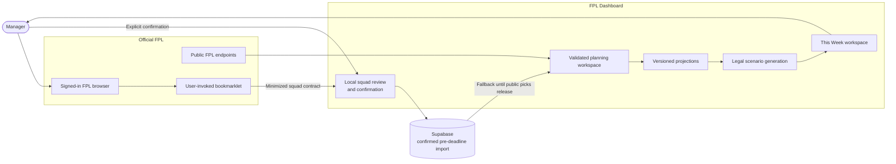

# FPL Dashboard

FPL Dashboard is a weekly planning and decision-support tool for Fantasy Premier League managers who want to improve their overall rank.

It starts with the manager's real current squad—even before the Gameweek deadline—and turns official FPL data into complete five-Gameweek plans with transfers, lineups, captaincy, projected outcomes, uncertainty, and explicit tradeoffs.

**Production:** https://fpl-dashboard-seven-pi.vercel.app/

## Updated vision

The product is evolving from an all-in-one matchday dashboard into a focused FPL decision workspace:

> Given my actual squad and the information available now, what are the strongest legal paths over the next five Gameweeks?

The primary user is a serious, rank-focused manager. Mini-league and rival information can provide context, but the optimizer does not assume a mini-league and does not optimize against individual rivals. Better overall-rank decisions naturally carry into smaller leagues.

The product does not hide uncertainty or manufacture one definitive answer. It presents complete scenarios, explains their tradeoffs, and lets the manager choose **My Plan**.

## The redesign

### This Week planning workspace

The redesigned `/planning` workspace compares three complete five-Gameweek strategies:

- **Floor** — emphasizes minutes security, availability, consistency, and downside protection.
- **Balanced** — maximizes expected points under the current model.
- **Upside** — accepts more variance in exchange for a higher ceiling.

Each scenario includes:

- transfers and points-hit cost;
- a legal 15-player squad;
- starting XI and bench order;
- captain and vice captain;
- bank remaining;
- Gameweek and five-Gameweek projections;
- uncertainty and the scenario's principal tradeoff.

Managers can constrain generation by locking players, excluding incoming targets, limiting points hits, and reserving money in the bank. When all three objectives converge on the same decisions, the workspace reports a robust recommendation and shows its floor, expected outcome, and ceiling instead of inventing artificial alternatives.

### Pre-deadline FPL connection

The pivotal redesign decision was adopting a **user-invoked Safari bookmarklet** as a browser-mediated, read-only FPL connector.

Before a deadline, FPL's public entry endpoints do not expose the manager's editable Pick Team squad, and FPL does not provide a supported third-party OAuth flow. The bookmarklet bridges that gap without asking FPL Dashboard to store the manager's FPL password or session:

1. The manager signs into the official FPL site.
2. They run the private bookmark from the FPL Pick Team page.
3. Code on the FPL origin reads the manager's current team using the existing browser session.
4. It reduces the response to a strict versioned contract containing only squad and planning fields.
5. FPL Dashboard clears the transport fragment, validates the data, resolves player details, and displays all 15 players for review.
6. Only after explicit confirmation is the squad saved for Planning.

This gives the optimizer the manager's true pre-deadline squad, selling prices, bank, transfer state, captaincy, bench order, and active-chip state. Passwords, cookies, bearer tokens, and reusable FPL session material never cross into the dashboard.

The confirmed squad can be refreshed, replaced, or cleared. It expires shortly after the deadline, and official public Gameweek picks become authoritative automatically once FPL publishes them.

The integration is intentionally read-only: the dashboard recommends and models FPL changes but does not submit transfers, activate chips, or update the official squad.

## What is live today

### Weekly decision support

- authenticated pre-deadline current-squad import and confirmation;
- Floor, Balanced, and Upside five-Gameweek scenarios;
- legal transfer, budget, squad, formation, lineup, bench, and captaincy handling;
- manager constraints and scenario regeneration;
- risk-range and robust-convergence explanations;
- device-local **My Plan** selection;
- deadline, freshness, model-version, and release identity indicators.

### Matchday and season context

- live, provisional, and official Gameweek score lifecycle;
- live 15-player squad pitch, minutes, points, captaincy, and bonus indicators;
- overall-rank snapshots and rank projection;
- fixture ticker with difficulty, blanks, and doubles;
- captaincy and transfer analysis;
- season trajectory, team value, chips, and Gameweek history;
- mini-league standings and live context.

### Production operations

- revocable, hashed dashboard sessions rather than raw Team ID cookies;
- strict authenticated-import validation and entry ownership checks;
- Supabase row-level security and server-only persistence access;
- release identity as `v<version> · <Git SHA>` in the UI and health response;
- configuration, database, and official-FPL readiness checks;
- hourly non-destructive production smoke testing;
- GitHub Actions gates for lint, unit tests, and the optimized production build;
- additive migrations and feature-flag rollback boundaries.

## Architecture at a glance



Official public picks take precedence once available. The confirmed import exists to make the otherwise inaccessible pre-deadline planning window useful.

For the complete design, see:

- [2026–27 as-built architecture and product design](docs/redesign/AS_BUILT_ARCHITECTURE_2026-27.md)
- [V1 product specification](docs/redesign/PRODUCT_SPEC.md)
- [Target architecture](docs/redesign/TARGET_ARCHITECTURE.md)
- [ADR 003: Authenticated squad import contract](docs/redesign/adr/003-authenticated-squad-import-contract.md)
- [ADR 004: Browser-mediated FPL integration](docs/redesign/adr/004-browser-mediated-fpl-integration.md)
- [2026–27 launch runbook](docs/operations/2026-27-launch-runbook.md)

## What comes next

The next milestone is post-GW1 learning and reproducibility:

1. Persist immutable season-aware source snapshots and generated scenarios.
2. Preserve and label the last valid snapshot during upstream degradation.
3. Persist **My Plan**, freeze it at the deadline, and evaluate decisions against outcomes.
4. Calibrate projections by position and forecast horizon using observed results.
5. Add chip opportunity modelling.
6. Complete redesigned Squad, Players, Fixtures, and History workspaces.
7. Add product telemetry and active failure notification.
8. Expand regression coverage with captured, sanitized real-world FPL payloads.

Automatic or unattended actions on the official FPL account are not on the approved roadmap. The near-term handoff remains explicit recommendations that the manager reviews and applies in FPL.

## Technology

- Next.js 16 App Router
- React 19
- TypeScript
- Supabase/Postgres
- Recharts
- CSS Modules and Tailwind/PostCSS tooling
- Vitest and Testing Library
- Playwright
- GitHub Actions and Vercel

## Repository structure

- [`src/app`](src/app) — App Router pages and product-oriented Route Handlers
- [`src/components`](src/components) — dashboard and Planning UI
- [`src/server`](src/server) — FPL gateway, planning validation, projections, and scenarios
- [`src/lib`](src/lib) — shared contracts, sessions, release metadata, and helpers
- [`supabase/migrations`](supabase/migrations) — additive persistence schema
- [`scripts`](scripts) — production verification tooling
- [`.github/workflows`](.github/workflows) — CI and scheduled smoke tests
- [`docs/redesign`](docs/redesign) — product, architecture, and decision records
- [`docs/testing`](docs/testing) — test strategy and operating guidance

## Local development

Install dependencies and start the development server:

```bash
npm install
npm run dev
```

Open http://localhost:3000. The redesigned workspace is available at `/planning` in development. Production enables it explicitly with:

```text
PLANNING_WORKSPACE_V1=true
```

The application also requires the Supabase URL, anonymous key, and server-only service-role key used by the existing deployment configuration.

## Validation

```bash
npm run lint
npm run test
npm run build
npm run test:e2e:smoke
npm run test:smoke
```

`npm run test:smoke` is non-destructive. It verifies production health, release identity, the Planning workspace and import contract, unauthenticated API protection, and security headers.

## Release and health

The lower-right release badge identifies the deployed version and Git commit. The same identity is returned by:

```text
GET /api/v1/health
```

A healthy response requires configuration, Supabase, and the official FPL upstream to pass. A degraded response returns HTTP 503 by design.

## Additional documentation

- [Testing documentation index](docs/testing/README.md)
- [Playwright testing handbook](docs/testing/PLAYWRIGHT_HANDBOOK.md)
- [Testing and documentation governance](docs/testing/TESTING_GOVERNANCE.md)
- [Legacy implementation architecture](ARCHITECTURE.md)
- [Original implementation plan](implementation_plan.md)
- [Original product overview](PRODUCT_OVERVIEW.md)

## Status

The 2026–27 Planning redesign and authenticated pre-deadline squad connection are live in production. The product is ready for weekly use and is now entering its learning, calibration, and reproducibility phase.
