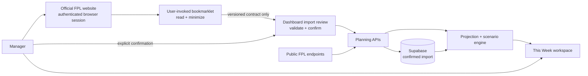
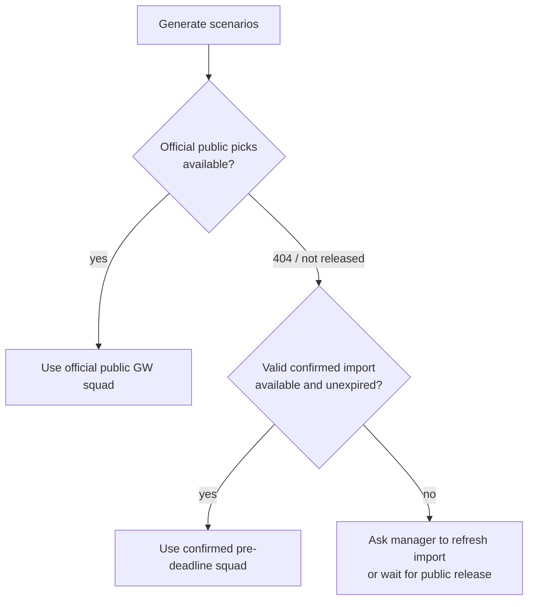

# FPL Dashboard 2026–27 — As-built architecture and product design

Status: Production baseline (`v0.6.9`)
Date: 2026-08-18

## Product position

FPL Dashboard is a weekly planning and decision-support product for managers seeking a higher overall FPL rank. It converts a manager's real current squad, the official fixture schedule, player data, and a versioned projection model into complete five-Gameweek plans with explicit risk and tradeoffs.

The core product is not a mini-league tracker and does not optimize against rivals. It helps answer: **given my actual squad and the information available now, what are the strongest legal paths over the next five Gameweeks?**

## The pivotal integration decision

Before a Gameweek deadline, FPL's public entry endpoints do not expose the manager's unfinalized Pick Team state. FPL also provides no documented third-party OAuth or supported application API for delegated access. A server-side integration would therefore require the manager's FPL credentials or copied session material, which is an unacceptable security boundary.

The adopted design is a **user-invoked, browser-mediated FPL connector**, implemented as a Safari bookmarklet:

1. The manager signs into the official FPL site normally.
2. From FPL's Pick Team page, the manager deliberately invokes the bookmark.
3. Code running on the FPL origin reads `/api/me/` and `/api/my-team/{entry}/` using the browser's existing authenticated session.
4. It immediately reduces the response to a strict, versioned squad contract.
5. The contract—not credentials, cookies, tokens, or the raw upstream response—is carried to FPL Dashboard in a URL fragment.
6. FPL Dashboard clears the fragment, validates the contract, resolves public player metadata, and requires the manager to review all 15 players and confirm.
7. The confirmed squad is stored against the dashboard's manager session until shortly after the applicable deadline.

This changed the product materially: Planning can now use the manager's true pre-deadline squad, selling prices, bank, transfer state, captaincy, bench order, and chip state instead of waiting until picks become public.

## System context



## Trust boundaries and data movement

### FPL origin

The bookmarklet executes only after a manager clicks it on `fantasy.premierleague.com`. The browser attaches FPL authentication to same-origin requests. The connector must never inspect, serialize, or transmit passwords, cookies, bearer tokens, CSRF material, or unrelated account data.

### Transport boundary

Contract schema v1 permits only:

- source, schema version, FPL entry ID, and capture time;
- 15 element IDs, lineup positions, purchase/selling prices, multipliers, and captaincy flags;
- active chip, bank, squad value, free-transfer state, transfers made, cost, and status.

Exact-field validation rejects unexpected properties. The URL fragment is not sent to the web server during navigation and is cleared immediately by the import page.

### Dashboard boundary

The manager sees resolved names, clubs, positions, prices, starting XI, bench, captain, and vice captain before confirmation. The server repeats contract validation and enforces entry ownership, freshness, squad composition, club limits, and formation rules.

### Persistence boundary

Only a confirmed contract is saved. Supabase row-level security denies anonymous browser access; server-side service-role code is the sole persistence path. A newer confirmation replaces the older one, and the manager can clear it explicitly.

## Planning data precedence



Official public picks become authoritative automatically once FPL releases them. The confirmed import is a pre-deadline fallback, not a competing long-term source of truth. It expires two hours after the deadline to accommodate delayed public availability without silently using old picks.

## Planning pipeline

```text
Official FPL public data + manager squad source
  -> ownership, freshness and legality validation
  -> normalized planning workspace
  -> deterministic versioned projections
  -> legal transfer, lineup and captaincy search
  -> Floor / Balanced / Upside objectives
  -> complete five-Gameweek scenarios and tradeoffs
  -> manager-selected My Plan
```

The three cards represent different objectives. When all objectives select the same move, lineup, and captain, the UI reports a robust recommendation and shows its floor, expected outcome, and ceiling rather than inventing artificial alternatives.

## Availability and operations

- `/api/v1/health` checks configuration, Supabase, and the FPL upstream, and exposes exact release identity.
- GitHub Actions runs lint, 129 tests, TypeScript/build validation, and production checks.
- Production smoke tests run hourly and verify the import contract, protected lifecycle APIs, Planning availability, security headers, and release metadata.
- If confirmed-import persistence is degraded, same-tab data can still be submitted directly; after the deadline, official public picks do not depend on the import store.
- The legacy dashboard and feature flag provide a rollback boundary.

## Updating the official FPL squad

The production integration is intentionally **read-only**. FPL Dashboard can model transfers, lineup, bench order, captaincy, and chips, but it does not currently write those decisions to the manager's official FPL account.

An authenticated FPL page is technically capable of making the same same-origin requests as the official UI. Community code has used undocumented write endpoints for transfers and picks. That does not make them a supported integration surface: payloads, CSRF requirements, validation rules, and endpoints may change without notice, and an error could create a points hit, activate a chip, or submit the wrong squad. FPL's published terms also restrict automated systems accessing and extracting game information.

Therefore automatic or scheduled FPL actions remain outside the approved architecture. The preferred near-term handoff is:

1. present the exact transfer, lineup, captaincy, bench, and chip instructions;
2. provide a concise checklist or copyable handoff;
3. open the appropriate official FPL page;
4. require the manager to make and confirm the change in FPL.

Any future browser-mediated write experiment requires its own legal/terms review and ADR. At minimum it must use an explicit preview on the FPL origin, a fresh read-before-write comparison, separate confirmation for transfers/hits/chips, deadline checks, no credential export, no unattended execution, a read-after-write verification, and a clear recovery path. Transfers and chips must never be bundled behind a single ambiguous confirmation.

## Known post-launch work

1. Persist immutable, season-aware source snapshots and generated scenarios.
2. Preserve and label the last valid planning snapshot during upstream degradation.
3. Persist My Plan and add deadline freezing, history, and outcome evaluation.
4. Calibrate projections using observed outcomes by position and horizon.
5. Add chip opportunity modelling.
6. Complete redesigned Squad, Players, Fixtures, and History workspaces.
7. Add product telemetry and active failure notification.
8. Add captured real-world FPL payload regression fixtures.

## External references

- [Official FPL terms and conditions](https://fantasy.premierleague.com/help/terms)
- [Community-maintained FPL OpenAPI description](https://github.com/mcclowes/fpl-oas)
